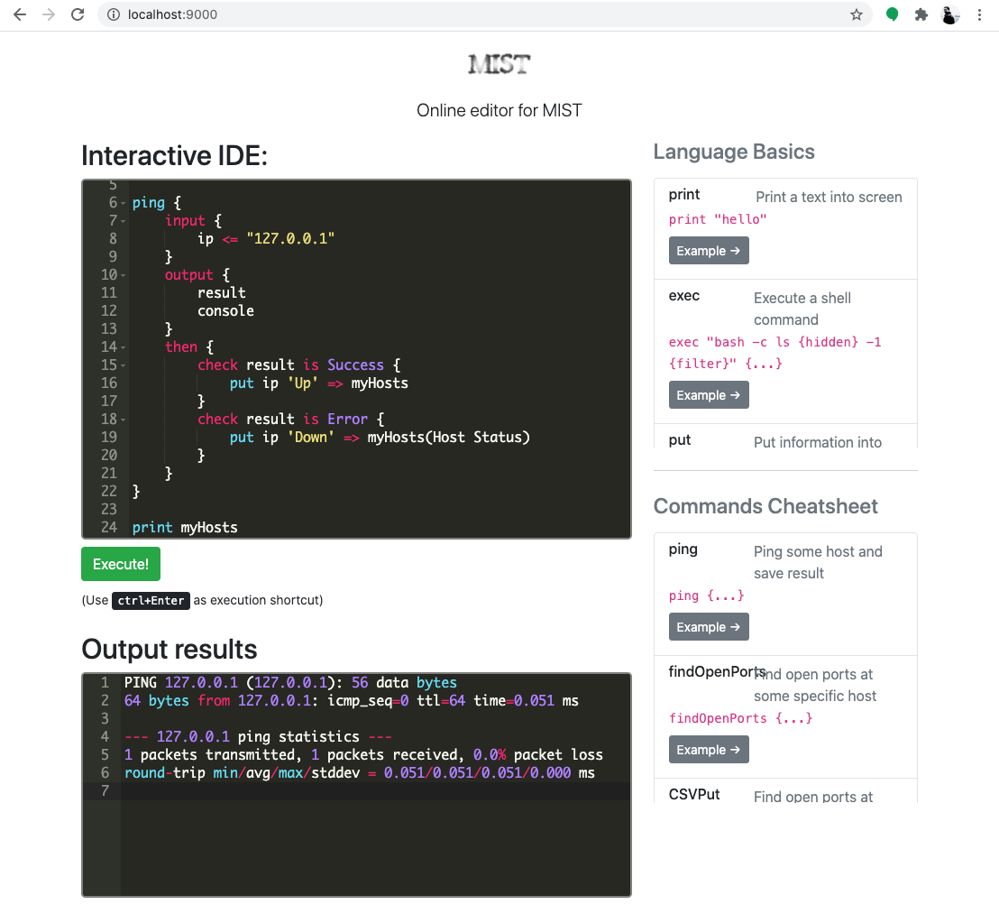

`MIST` a high level programming language focussed in security

# Install

```bash
> pip install mist-lang
```

# Screenshots



# Local usage

## Run a mist file

```bash
mist run examples/ping.mist
```

## Launch editor

```bash
mist editor
```

# Developers

After clone the repository, you can urn `MIST` without install them:

```bash
> git clone https://github.com/cr0hn/mist
> cd mist
> python3 -m pip install -r requirements.txt
> python3 -m mist -h
```

# Docker usage

## Image build

```bash
docker build -t mist-lang .
```

## Run a mist file with Docker

```bash
docker run -v $(pwd)/examples:/examples -v mist:/root/.mist mist-lang run examples/ping.mist
```

## Launch editor with Docker

```bash
docker run -p 9000:9000 -t mist-lang editor -l 0.0.0.0
```

# License

This project is distributed under `BSD license <https://github.com/cr0hn/mist/blob/master/LICENSE>`_
