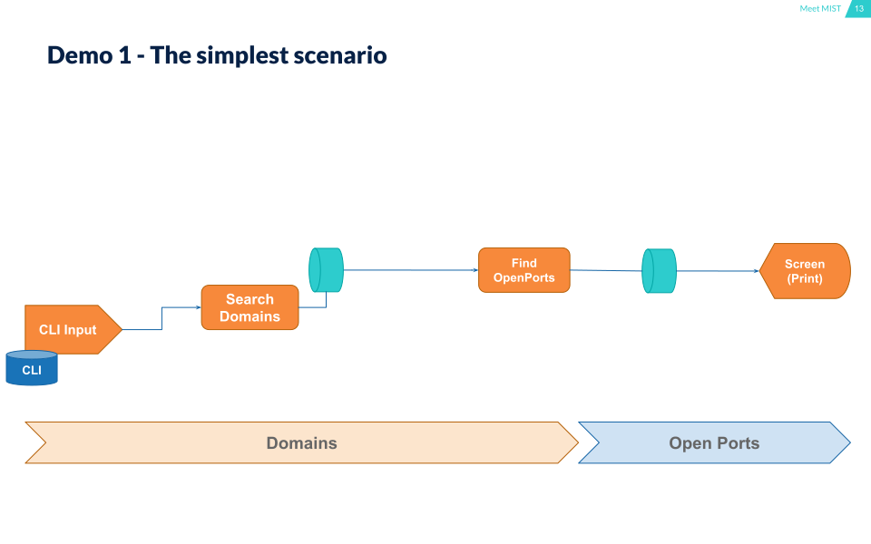
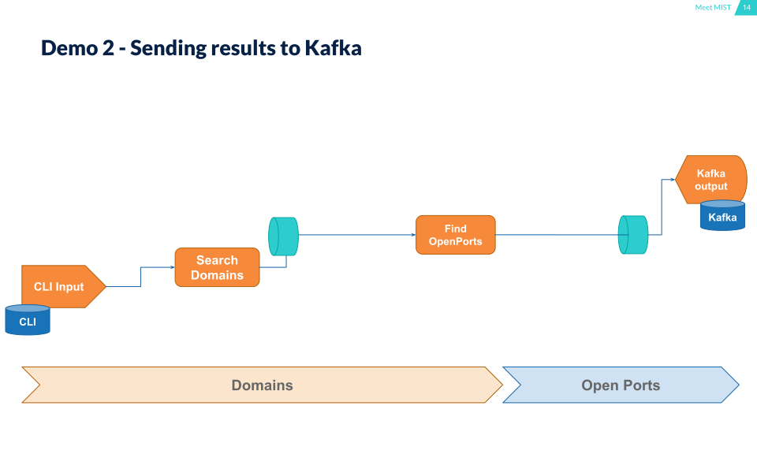
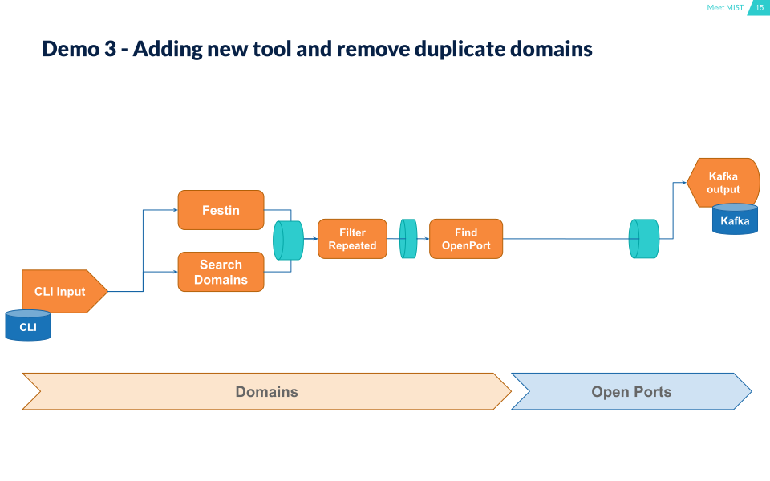
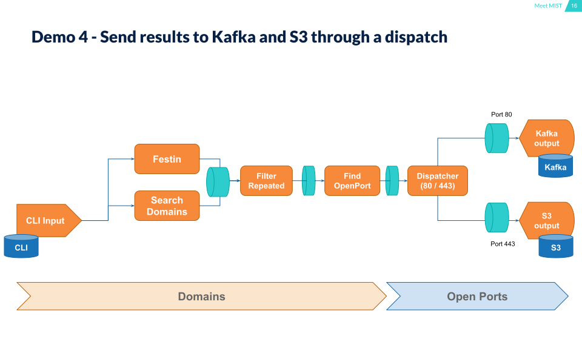
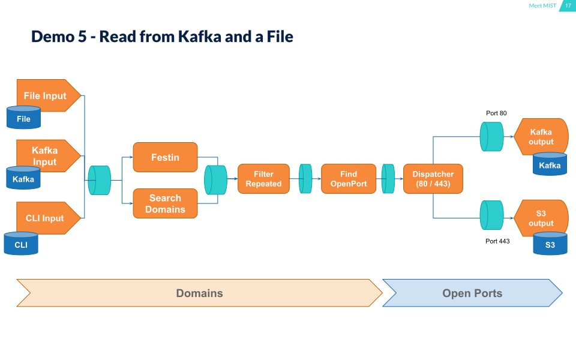

When you need to create complex Workflows and need to communicate different tools working together, maybe you need `MIST`.

# Why is MIST

`MIST` is a high level programming language for defining executions workflows easily.

Ab execution is a command line tool you can invoke from `MIST`. They will connect the tools and manage executions and synchronization fo you. 

# Installing

```bash
> pip install mist-lang
```

# Quick Start

## Demo 1 - The simplest scenario

In this scenario we do:

1. `CLI Input` - Read a domain as a parameter from CLI.
2. `Search Domains` - Use MIST function for search related domains / sub-domains from a start domain.
3. `Fin OpenPorts` - Search open port for each new domain / sub-domain found.   
4. `Screen (Pring)` - Displays the results into the screen (by using MIST 'print' function). 


**Use case diagram**



**MIST code**

```bash
include "searchDomains" "findOpenPorts"

searchDomains(%domain) => foundDomains

findOpenPorts(:foundDomains, "80,443") => openPortsFound

print(:openPortsFound)
```

## Demo 2 - Sending results to Kafka

**Use case diagram**



**MIST code**

```bash
include "searchDomains" "findOpenPorts" "kafkaProducer"

searchDomains(%domain) => foundDomains

findOpenPorts(:foundDomains, "80,443") => openPortsFound

kafkaProducer($KAFKA_SERVER, "domainsTopic", :openPortsFound)
```

## Demo 3 - Adding new tool and remove duplicate domains

**Use case diagram**



**MIST code**

```bash
include "searchDomains" "festin" "findOpenPorts" "filterRepeated" "kafkaProducer"

searchDomains(%domain) => foundDomains
festin(%domain, $DNS_SERVER, True) => foundDomains

filterRepeated(:foundDomains, False) => nonRepeatedFoundDomains

findOpenPorts(:nonRepeatedFoundDomains, "80,443") => openPortsFound

kafkaProducer($KAFKA_SERVER, "domainsTopic", :openPortsFound)

```

## Demo 4 - Send results to Kafka and S3 through a dispatcher

**Use case diagram**



**MIST code**

```bash
include "searchDomains" "festin" "findOpenPorts" "filterRepeated" "kafkaProducer" "S3Store"

function dispacher(p) {
    if (isEqual(p.port, "80")) {
        send(p, "kafkaOutput")
    } else {
        send(p, "S3Output")
    }
}

searchDomains(%domain) => foundDomains
festin(%domain, $DNS_SERVER, True) => foundDomains

filterRepeated(:foundDomains, False) => nonRepeatedFoundDomains

findOpenPorts(:nonRepeatedFoundDomains, "80,443") => openPortsFound

dispacher(:openPortsFound)

kafkaProducer($KAFKA_SERVER, "domainsTopic", :kafkaOutput)

S3Store(:S3Output, $BUCKET_URI)

```

## Demo 5 - Read from Kafka and a File

**Use case diagram**



**MIST code**

```bash
include "searchDomains" "festin" "findOpenPorts" "filterRepeated" "kafkaProducer" "S3Store" "kafkaConsumer" "tail"

function dispacher(p) {
    if (isEqual(p.port, "80")) {
        send(p, "kafkaOutput")
    } else {
        send(p, "S3Output")
    }
}

kafkaConsumer($KAFKA_SERVER, "inputDomains", "*END*", False) => inputDomains
tail("domains.txt", "*END*") => inputDomains
send(%domain, "inputDomains")

searchDomains(:inputDomains) => foundDomains
festin(:inputDomains, $DNS_SERVER, True) => foundDomains

filterRepeated(:foundDomains, False) => nonRepeatedFoundDomains

findOpenPorts(:nonRepeatedFoundDomains, "80,443") => openPortsFound

dispacher(:openPortsFound)

kafkaProducer($KAFKA_SERVER, "domainsTopic", :kafkaOutput)

S3Store(:S3Output, $BUCKET_URI)

```


## Authors

MIST is being developed by BBVA-Labs Security team members.

## Contributions

Contributions are of course welcome. See [CONTRIBUTING](https://github.com/BBVA/mist/blob/master/CONSTRIBUTING.rst) or skim existing tickets to see where you could help out.

## License

MIST is Open Source Software and available under the [Apache 2 license](https://github.com/BBVA/mist/blob/master/LICENSE)
